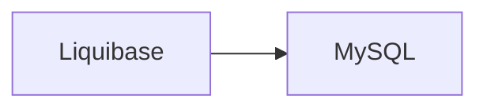

# erinlkolp / liquibase-percona-mysql-docker-demo

This repository is an **example template** using Liquibase, Docker, and GitHub Actions for Continuous Integration.


## Use

You can use this repository today by forking and replacing the following files with your own:

 - demodb.sql # This could be a bare schema definition or a database dump, depending on the situation.
 - schema/*   # Replace the files with your own. You can name them numerically to control the sequence.

## Example Migrations

```xml
<?xml version="1.0" encoding="UTF-8"?>

<databaseChangeLog
  xmlns="http://www.liquibase.org/xml/ns/dbchangelog"
  xmlns:xsi="http://www.w3.org/2001/XMLSchema-instance"
  xsi:schemaLocation="http://www.liquibase.org/xml/ns/dbchangelog
         http://www.liquibase.org/xml/ns/dbchangelog/dbchangelog-3.8.xsd"
  xmlns:liquibasePercona="http://www.liquibase.org/xml/ns/dbchangelog-ext/liquibase-percona"
  liquibasePercona:usePercona="true">
    <changeSet author="user" id="150-1">
        <addColumn tableName="example">
            <column name="town" type="VARCHAR(60 BYTE)"/>
        </addColumn>
    </changeSet>
</databaseChangeLog>
```

```yaml
databaseChangeLog:
- changeSet:
    id: 151-1
    author: Erin L. Kolp
    changes:
    - addColumn:
        tableName: example
        usePercona: false
        columns:
          - column:
              name: address
              type: varchar(255)
```

## Notable Components

#### Liquibase Container Startup Delay

```bash
  db:
    container_name: db
    ...
    healthcheck:
      # Truth be told, I don't really care what this returns as long as it exits zero.
      #   I needed a startup delay on the Liquibase container so that there was ample time
      #   for the db to fully initialize. -elk
      test: bash -c "/usr/bin/netstat -ltn | grep -c 3306"
      interval: 15s
      retries: 5
      start_period: 20s # This controls the startup delay of the Liquibase container.
      timeout: 5s

```

## Command Reference

#### To build this, type:
```bash
docker-compose build
```

#### To run this, type:
```bash
docker-compose up
```

#### To stop this, type:
```bash
docker-compose down
```
