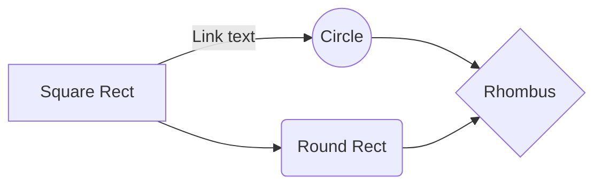

# erinlkolp / liquibase-percona-mysql-docker-demo

This repository is an **example template** using Liquibase, Docker, and GitHub Actions for Continuous Integration.



You can use this repository today by forking and replacing the following files with your own:

 - demodb.sql # This could be a bare schema definition or a database dump, depending on the situation.
 - schema/*   # Replace the files with your own. You can name them numerically to control the sequence.

#### To build this, type:
```bash
docker-compose build
```

#### To run this, type:
```bash
docker-compose up
```

#### To stop this, type:
```bash
docker-compose down
```
