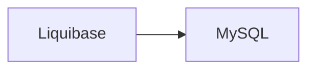

# erinlkolp / liquibase-percona-mysql-docker-demo

This repository is an **example template** using [Liquibase](https://github.com/liquibase/liquibase), [Percona Toolkit](https://github.com/percona/percona-toolkit), [Docker](https://github.com/liquibase/docker), and [GitHub Actions](https://github.com/erinlkolp/liquibase-percona-mysql-docker-demo/actions) for Continuous Integration of database schema migrations via automation.


## Use

You can use this repository today by forking and replacing the following files with your own:

 - demodb.sql # This could be a bare schema definition or a database dump, depending on the situation.
 - schema/*   # Replace the files with your own. You can name them numerically to control the sequence.

## Example Migrations

XML:

```xml
<?xml version="1.0" encoding="UTF-8"?>

<databaseChangeLog
  xmlns="http://www.liquibase.org/xml/ns/dbchangelog"
  xmlns:xsi="http://www.w3.org/2001/XMLSchema-instance"
  xsi:schemaLocation="http://www.liquibase.org/xml/ns/dbchangelog
         http://www.liquibase.org/xml/ns/dbchangelog/dbchangelog-3.8.xsd"
  xmlns:liquibasePercona="http://www.liquibase.org/xml/ns/dbchangelog-ext/liquibase-percona"
  liquibasePercona:usePercona="true">
    <changeSet author="user" id="150-1">
        <addColumn tableName="example">
            <column name="town" type="VARCHAR(60 BYTE)"/>
        </addColumn>
    </changeSet>
</databaseChangeLog>
```

Yaml:

```yaml
databaseChangeLog:
- changeSet:
    id: 151-1
    author: Erin L. Kolp
    changes:
    - addColumn:
        tableName: example
        usePercona: false
        columns:
          - column:
              name: address
              type: varchar(255)
```

## Notable Components

#### Liquibase Container Startup Delay

```yaml
  db:
    container_name: db
    ...
    healthcheck:
      # Truth be told, I don't really care what this returns as long as it exits zero.
      #   I needed a startup delay on the Liquibase container so that there was ample time
      #   for the db to fully initialize. -elk
      test: bash -c "/usr/bin/netstat -ltn | grep -c 3306"
      interval: 15s
      retries: 5
      start_period: 20s # This controls the startup delay of the Liquibase container.
      timeout: 5s

```

## Command Reference

#### To build this, type:
```bash
docker-compose build
```

#### To run this, type:
```bash
docker-compose up
```

#### To stop this, type:
```bash
docker-compose down
```

# License & Author

- Author:: Erin L. Kolp (<erinlkolpfoss@gmail.com>)

Copyright (c) 2025 Erin L. Kolp 

Licensed under the MIT License

Permission is hereby granted, free of charge, to any person obtaining a copy of this software and associated documentation files (the 'Software'), to deal in the Software without restriction, including without limitation the rights to use, copy, modify, merge, publish, distribute, sublicense, and/or sell copies of the Software, and to
permit persons to whom the Software is furnished to do so, subject to the following conditions:

The above copyright notice and this permission notice shall be included in all copies or substantial portions of the Software.

THE SOFTWARE IS PROVIDED 'AS IS', WITHOUT WARRANTY OF ANY KIND, EXPRESS OR IMPLIED, INCLUDING BUT NOT LIMITED TO THE WARRANTIES OF MERCHANTABILITY, FITNESS FOR A PARTICULAR PURPOSE AND NONINFRINGEMENT.  IN NO EVENT SHALL THE AUTHORS OR COPYRIGHT HOLDERS BE LIABLE FOR ANY CLAIM, DAMAGES OR OTHER LIABILITY, WHETHER IN AN ACTION OF CONTRACT, TORT OR OTHERWISE, ARISING FROM, OUT OF OR IN CONNECTION WITH THE SOFTWARE OR THE USE OR OTHER DEALINGS IN THE SOFTWARE.