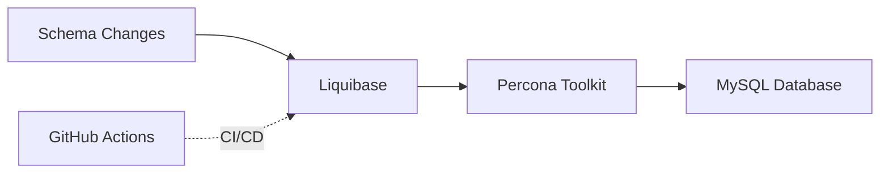

# erinlkolp / liquibase-percona-mysql-docker-demo

This repository is an **example template** using [Liquibase](https://github.com/liquibase/liquibase), [Percona Toolkit](https://github.com/percona/percona-toolkit), [Docker](https://github.com/liquibase/docker), and [GitHub Actions](https://github.com/erinlkolp/liquibase-percona-mysql-docker-demo/actions) for Continuous Integration of database schema migrations via automation.


```mermaid
graph LR
    A[Schema Changes] --> B[Liquibase]
    B --> C[Percona Toolkit]
    C --> D[MySQL Database]
    E[GitHub Actions] -.CI/CD.-> B
```
## Getting Started

Fork this repository and customize the following files for your database:

- **demodb.sql** - Your base database schema or initial data dump
- **schema/** - Your Liquibase migration files (XML or YAML format)
  - Files are processed in alphabetical order - use numeric prefixes to control sequence (e.g., `001-initial.xml`, `002-add-users.yaml`)

## Example Migrations

XML:

```xml
<?xml version="1.0" encoding="UTF-8"?>

<databaseChangeLog
  xmlns="http://www.liquibase.org/xml/ns/dbchangelog"
  xmlns:xsi="http://www.w3.org/2001/XMLSchema-instance"
  xsi:schemaLocation="http://www.liquibase.org/xml/ns/dbchangelog
         http://www.liquibase.org/xml/ns/dbchangelog/dbchangelog-3.8.xsd"
  xmlns:liquibasePercona="http://www.liquibase.org/xml/ns/dbchangelog-ext/liquibase-percona"
  liquibasePercona:usePercona="true">
    <changeSet author="user" id="150-1">
        <addColumn tableName="example">
            <column name="town" type="VARCHAR(60 BYTE)"/>
        </addColumn>
    </changeSet>
</databaseChangeLog>
```

Yaml:

```yaml
databaseChangeLog:
- changeSet:
    id: 151-1
    author: Erin L. Kolp
    changes:
    - addColumn:
        tableName: example
        usePercona: false
        columns:
          - column:
              name: address
              type: varchar(255)
```

## Notable Components

#### Service Dependencies and Health Checks

The Liquibase container waits for the MySQL database to be fully initialized before running migrations:

```yaml
  db:
    healthcheck:
      # Ensures MySQL is listening before starting dependent services
      test: ["CMD", "bash", "-c", "netstat -ltn | grep -q 3306"]
      interval: 15s
      retries: 5
      start_period: 20s
      timeout: 5s

  liquibase:
    depends_on:
      db:
        condition: service_healthy
```

This prevents migration failures due to the database not being ready.

## Command Reference

#### Build the containers:
```bash
docker compose build
```

#### Start the services:
```bash
docker compose up
```

#### Stop the services:
```bash
docker compose down
```

> **Note:** These commands use Docker Compose V2 syntax (`docker compose`). If you're using V1, use `docker-compose` instead.

# License & Author

- Author:: Erin L. Kolp (<erinlkolpfoss@gmail.com>)

Copyright (c) 2025 Erin L. Kolp 

Licensed under the MIT License

Permission is hereby granted, free of charge, to any person obtaining a copy of this software and associated documentation files (the 'Software'), to deal in the Software without restriction, including without limitation the rights to use, copy, modify, merge, publish, distribute, sublicense, and/or sell copies of the Software, and to
permit persons to whom the Software is furnished to do so, subject to the following conditions:

The above copyright notice and this permission notice shall be included in all copies or substantial portions of the Software.

THE SOFTWARE IS PROVIDED 'AS IS', WITHOUT WARRANTY OF ANY KIND, EXPRESS OR IMPLIED, INCLUDING BUT NOT LIMITED TO THE WARRANTIES OF MERCHANTABILITY, FITNESS FOR A PARTICULAR PURPOSE AND NONINFRINGEMENT.  IN NO EVENT SHALL THE AUTHORS OR COPYRIGHT HOLDERS BE LIABLE FOR ANY CLAIM, DAMAGES OR OTHER LIABILITY, WHETHER IN AN ACTION OF CONTRACT, TORT OR OTHERWISE, ARISING FROM, OUT OF OR IN CONNECTION WITH THE SOFTWARE OR THE USE OR OTHER DEALINGS IN THE SOFTWARE.